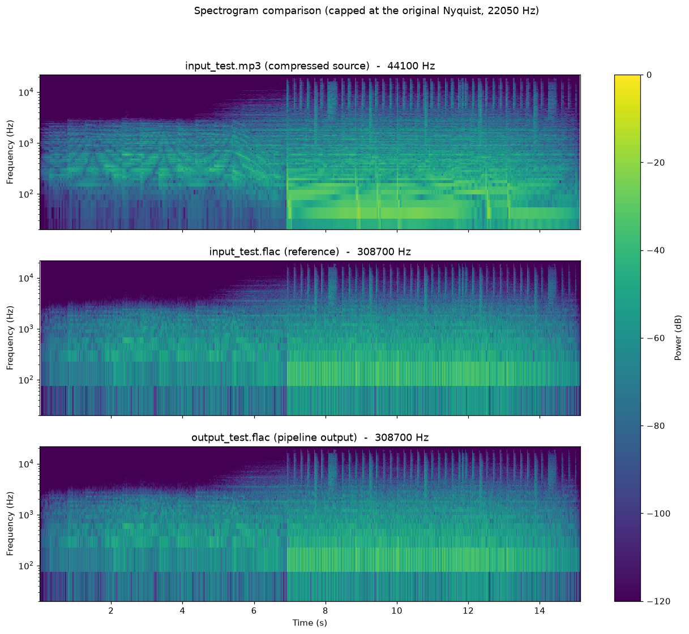

# Fat Llama   
fat_llama is a Python package for upscaling audio files to FLAC or WAV formats using advanced audio processing techniques. It utilizes cpu-accelerated calculations to enhance audio quality by upsampling and adding missing frequencies through FFT (Fast Fourier Transform), resulting in richer and more detailed audio.

## Features

- Upscale MP3 files to high-quality FLAC format.
- Iterative soft thresholding (IST) for enhanced audio processing.
- Auto-scaling amplitude adjustment and normalization.
- Multi-Threaded processing on cpu.

## Installation

Install via pip:
```
pip install fat-llama-fftw
```
**(Note: For CUDA verison please look at https://pypi.org/project/fat-llama/)**

Also, requires ffmpeg: https://support.audacityteam.org/basics/installing-ffmpeg

## Usage

### Example Usage

You can run the example provided in example.py:

```
from fat_llama_fftw.audio_fattener.feed import upscale

# Example call to the method
upscale(
    input_file_path='input_test.mp3',
    output_file_path='output_test.flac',
    source_format='mp3',
    target_format='flac',
    max_iterations=1000,
    threshold_value=0.6,
    target_bitrate_kbps=1400
)
```
### Function Parameters

- `input_file_path (str)`: Path to the input audio file. Mandatory.
- `output_file_path (str)`: Path to the output processed audio file. Mandatory.
- `source_format (str)`: Format of the input audio file (e.g., 'mp3', 'wav', 'ogg', 'flac').
- `target_format (str)`: Format of the output audio file (e.g., 'flac', 'wav'). Default is 'flac'.
- `max_iterations (int)`: Maximum number of iterations for IST. Default is 800.
- `threshold_value (float)`: Threshold value for IST. Default is 0.6.
- `target_bitrate_kbps (int)`: Target bitrate in kbps. Default is 1411.

## Running the Example

To run the example, execute the following command:
```
python example.py
```
This will upscale the MP3 file specified in the example and produce a FLAC file with full processing.

## Spectrogram Results



<!-- AUDIO_QUALITY_SCORES:START -->
## Audio Quality Scores

Generated by the `test-fat-llama` skill's `audio-quality-checker` subagent — updated each run, not hand-edited.

| Metric | Score | Notes |
|---|---|---|
| Coherence (upscale quality, 0-10) | 9.5 | every hard check clean and mostly beats the reference (peak exactly 1.0, DC/above-Nyquist/discontinuities/hop-boundary all clean); the interpolation rewrite (zero-order-hold to bandlimited FFT-domain) closed the long-standing "no added detail" gap - the reference's thinnest 5% of in-band bins gain +8.03dB, with clear positive gains from 8kHz to 22.05kHz (up to +5.36dB), confirmed programme-correlated rather than a noise-floor rise |
| Spectral deviation vs. reference FLAC (0-10) | 9.9 | convergence=0.9713, correlation=0.9998 against input_test.flac; note input_test.flac is itself a legacy zero-order-hold-era pipeline output, not a clean master, so this should not be read as a quality ceiling |
<!-- AUDIO_QUALITY_SCORES:END -->

## How it works


## Algorithm Explanation

The upscaling process involves several steps:

1. **Reading Audio File**: The audio file is read, and the audio samples are extracted along with the sample rate and bitrate.
2. **Calculating Upscale Factor**: The upscale factor is calculated to achieve the target bitrate.
3. **Upscaling Channels**: The audio channels are upscaled using an interpolation algorithm. Each sample is repeated multiple times to increase the resolution.
4. **Iterative Soft Thresholding (IST)**: IST is applied to enhance the audio by adding missing frequencies. This process uses FFT to transform the signal into the frequency domain, apply a threshold to keep significant frequencies, and then inverse transform back to the time domain.
5. **Scaling Amplitude**: The amplitude of the upscaled audio is scaled to match the original.
6. **Normalizing Audio**: The audio is normalized to the range -1 to 1.
7. **Writing FLAC File**: The processed audio is written to a FLAC file.

## Why FFT and IST?

FFT (Fast Fourier Transform) is used to transform the audio signal into the frequency domain. This allows for the identification and manipulation of specific frequency components. By applying a threshold in the frequency domain, we can keep significant frequencies and discard noise and add it to our upscaling data to add detail to upscaling frequencies.

The report titled "Fast Sparse Fourier Transformations for NMR Spectroscopy" by Badruddin Kamal, supervised by Thomas Huber and Alastair Rendall, 2015, provides a comprehensive understanding of sparse representations and their applications in signal processing. IST leverages the concepts from this report to add missing frequencies and enhance the audio quality by making it more detailed and rich. This is particularly useful in upscaling audio where some frequencies might be missing or congested.

### Test Audio Source

ericzo - beyond link(https://soundcloud.com/ericzomusic/free-electro-trap-anthem-beyond)

## Changelog

Changes are now logged in CHANGELOG.md